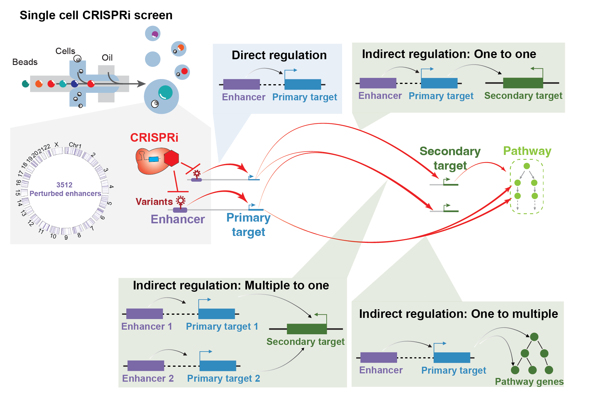

## Overview
This repository contains the jupyter lab notebooks of analysis and plotting after performing pySpade analysis of breast cancer associated enhancers perturbations.

[Link to pySpade](https://github.com/yihan1119/pySpade)

## Requirement
* Python (3.7 +)
* Numpy (1.16 +)
* Pandas (0.25 +)
* Scipy (1.1 +)
* Matplotlib (3.3 +)
* pyCircos (0.3.0 +)

## Fastq files
GEO accession

## Contributors 
* First Author: Yihan Wang `Yihan.Wang@UTSouthwestern.edu`
* Corresponding Author: Gary Hon `Gary.Hon@UTSouthwestern.edu`
